# Table of Contents
* [About & Directory](#about-&-directory)
* [Task Description](#task-description)
* [General Design Info](#general-design-info)
* [Demo](#demo)
* [Try it](#try-it)
* [Proof of Concept](#proof-of-concept)
* [API Usage](#api-usage)
    * [Background](#background)
    * [List](#list)
    * [Create](#create)
    * [Deduct](#deduct) 
* [Admin](#admin)
* [Technologies](#technologies)
* [Setup](#setup)
* [About Me](#about-me)

## About & Directory
   
   ### About
   
   This is a Django REST API built to manage a database of users, payers and transactions. It is designed to keep track of where points go and spend the oldest points first.
   
   ### Directory
   
   To read about the problem, general design choices and to see a visual demo, start at the [Task Description](#task-description) section. It is recommended to start here.
   
   To read more about the main logic of the project navigate, to the [Proof of Concept](#proof-of-concept) section. This section also relates the Django Models to simpler data structures to better understanding their usage.
   
   To read about an easy way to follow what is occurring in the database as you make changes, read the [Admin](#admin) section.
   
   To learn how to get set up, start at the [Technologies](#technologies) section.
   
   To learn more about using the API, navigate over to the [API Usage](#api-usage) section. 
   
   For a [link to a hosted version](https://django-points-api.herokuapp.com/api/) of the project to quickly test and run without local installation. 
   
## Task Description
  
   Users only see a single balance in their account. These points come from certain payers. The accounting team wants to keep track of where the points are coming from and how they are being spent.
   Design a system that follows these constraints:
   * Oldest points are spent first
   * No payer's balance for a user should go negative.

## General Design Info
  
   The database stores 5 types. (User, Payer, Balance, Transaction and FundQueue)
   
   The model User stores all the names of users and respective total balances.
   
   The model Payer stores all the names of payers.
   
   The model Balance stores all the balances of users for a specific payer. 
   Each payer has a balance sheet, which contains all users who have transactions with that payer. This model is that balance sheet.
   
   The model Transaction stores a history of all transactions. Each transaction object has the user, payer, points, date and an ID.
   
   The model FundsQueue is simply a transaction clone that houses a queue of funds to be spent in order. The main difference is that FundsQueue objects can only contain positive points, (these are points to spend) and can be modified and deleted, but Transactions contains a history that cannot be modified and also records negative points.
    
   Here is a diagram of the above models:
   
   
   
   Django REST framework is accessed by utilizing serializers, which provides a convenient way to convert a model to a JSON. The framework also includes the Response function which provides a quick setup of generic API interacting frontend to display and test the backend without using a tool like Postman.
    
   Signals are also utilized to update the balances or create prerequisite objects by listening for when a Transaction is about to be created.
   
   The admin panel is mostly Django generated, but is customized to include related objects.
    
## Demo
   
   When using the website in a browser, the below image should be the first thing you see.
   
   Assuming that the database is empty. Most calls will return a 404 as there is nothing in the database to display.
   
   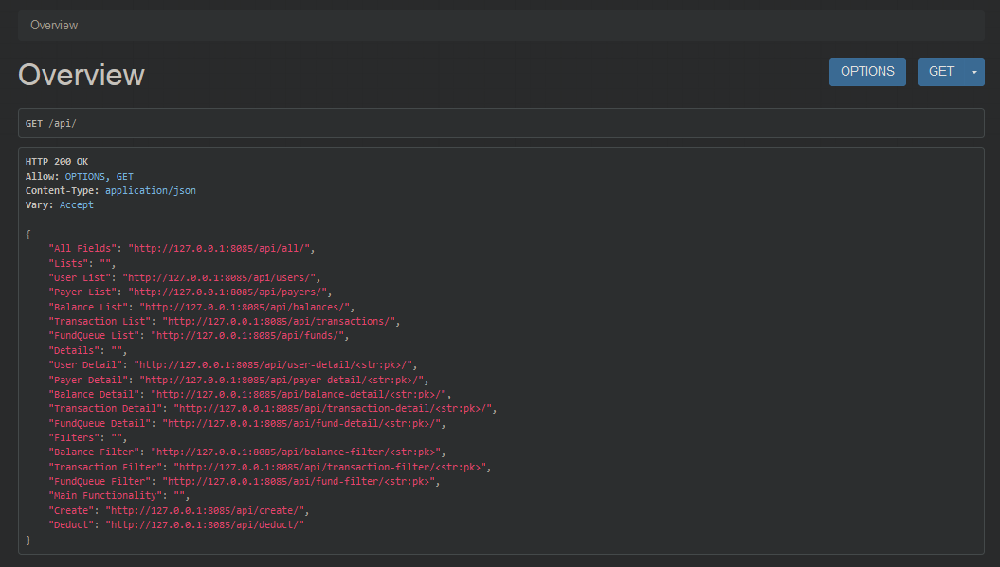
   
   
   Let us add a transaction to the database. Navigate to the create link near the bottom in the overview response. 
   We supply a JSON with a user, payer and points for the transaction. 
   
   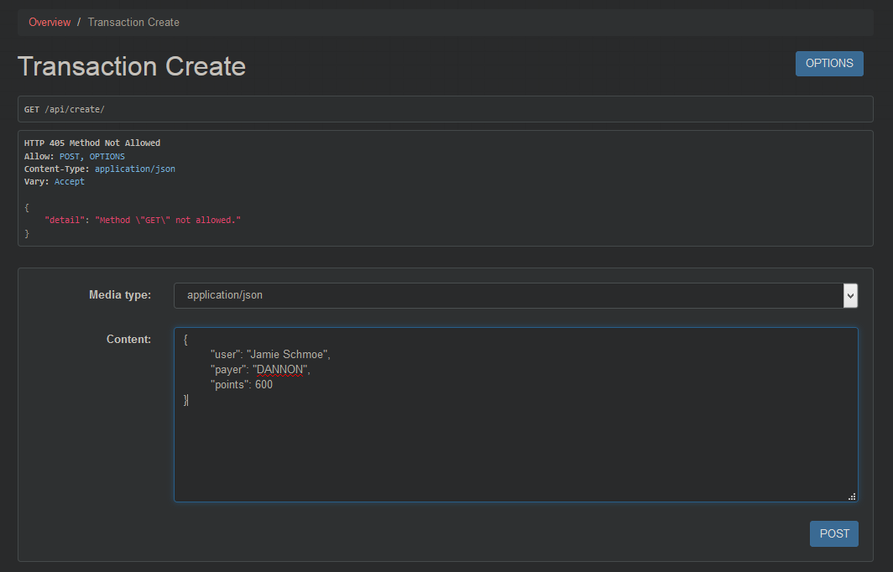
    
   This is the response we get:
   
   
   
   What happens under the hood? As we know our database was empty. Let us look at our new user's admin panel. The user and payer did not exist initially, but along with this transaction, they were created. They are initialized to the transaction amount, as they gained that amount from that transaction. 
   
   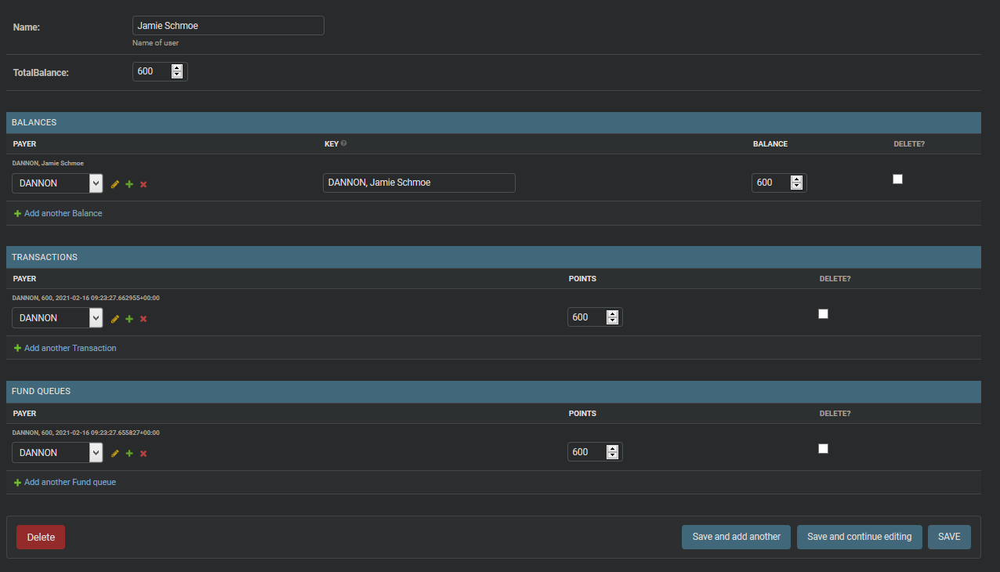
   
   Let us add another two transaction to the database. The responses are similar to before.
   
   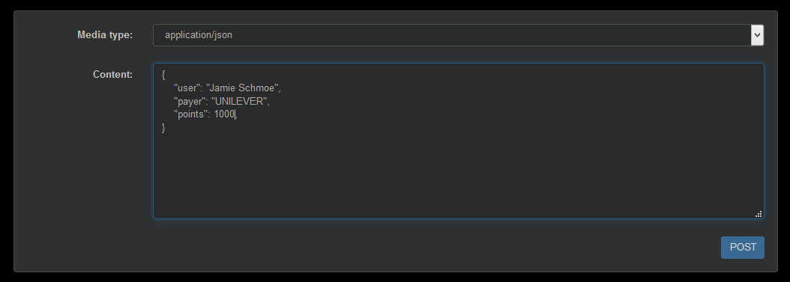
   
   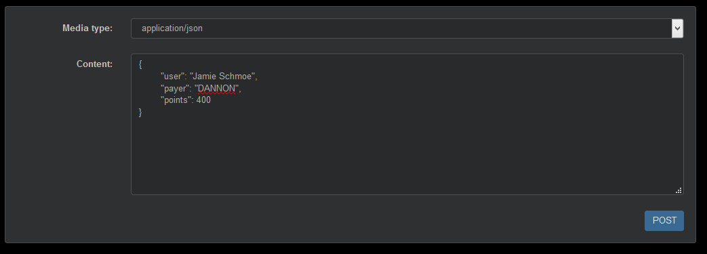
    
   The user now has 2000 points, 3 Transactions and 3 FundQueues, 2 Payers and 2 Balances of 1000 for the first payer, and 1000 for the second. Let us look at the admin panel displaying this information:
   
   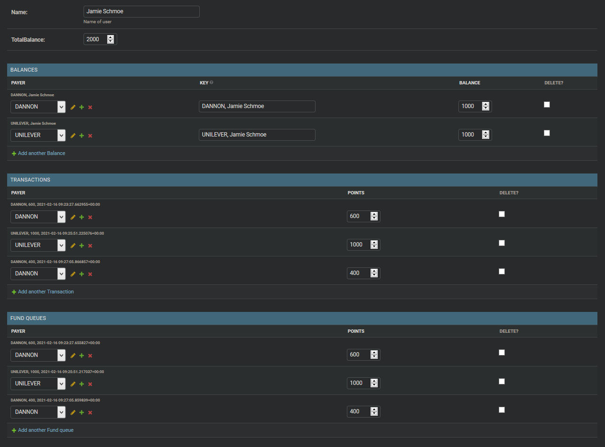
   
   Now, let us deduct from the user. We navigate to the deduct page from overview, and supply a JSON with the user and the points.
   
   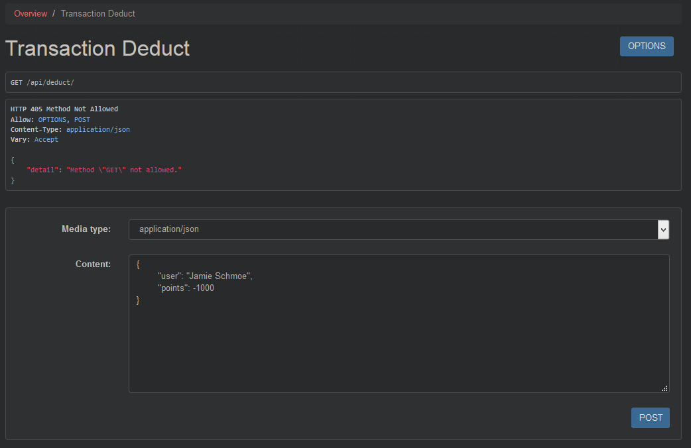
    
   The response:
   
   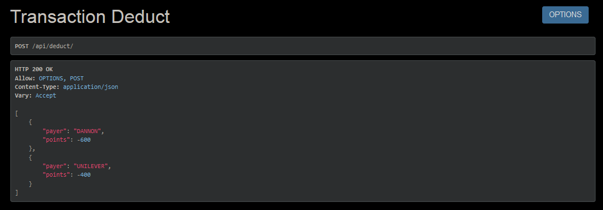
   
   Looking at the admin page below, we notice that we took 600 from the first payer, and 400 from the second, rather than taking the entire 1000 from a single payer. This is because we want to spend the oldest points first. Also notice how the Transaction contains a history of what occurred, but FundQueue is now altered. We took the first FundQueue object, spent it entirely for 600 points, then discarded it, as we can no longer spend it. Then we moved on to the second FundQueue object, took 400 out of it, and kept it, as it still has 600 points we can spend. Finally, notice how the total balance is deducted by the amount provided in the API call.
   
   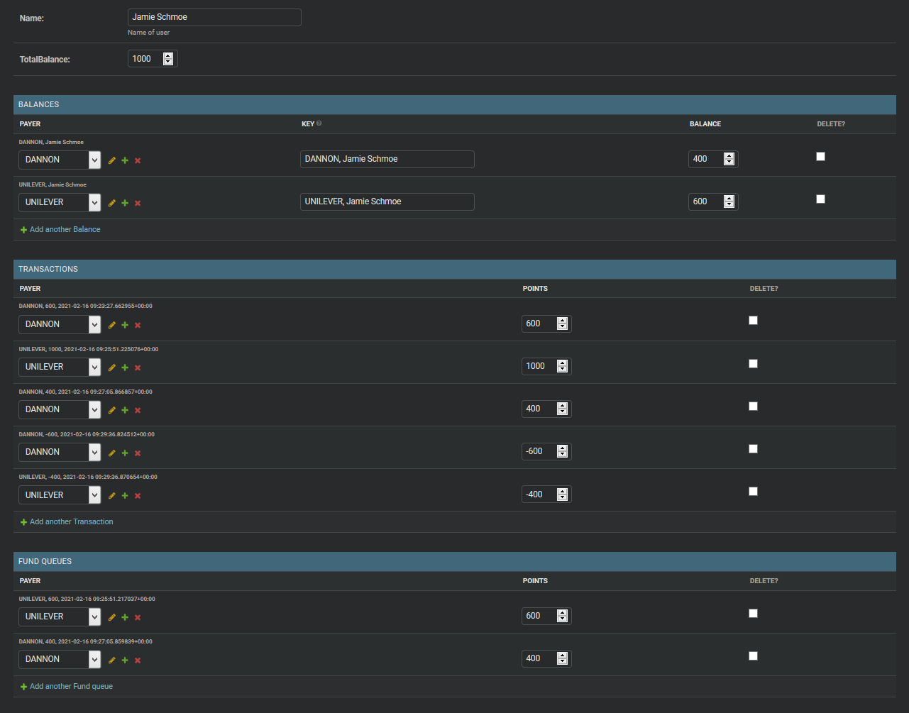
    
   Let us deduct by 1000 again:
   
   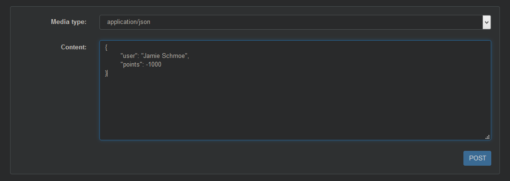
   
   Here is our admin page after this operation. What is notable here is that all balances are zero and our FundQueue is empty, as we have no points to spend.
   
   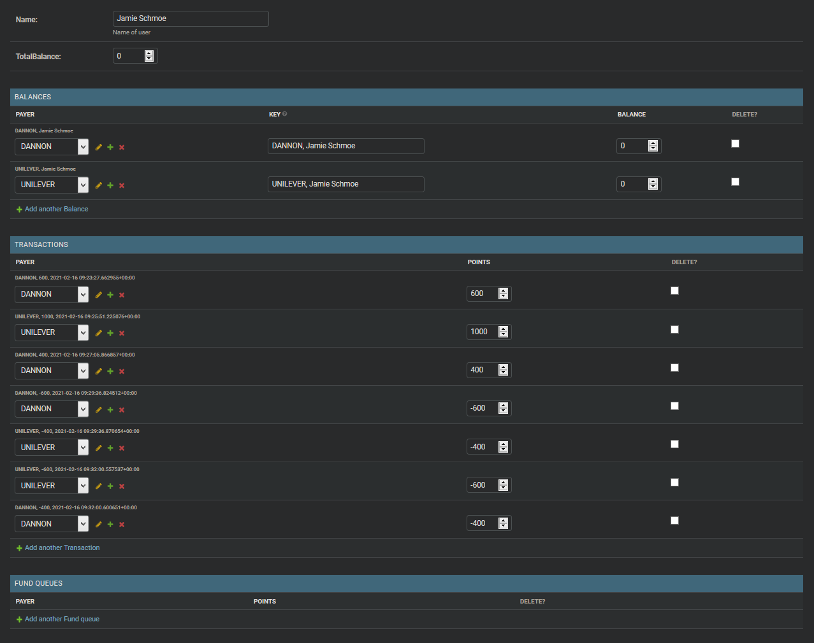
   
## Try it

To try the app for yourself, use this [link](https://django-points-api.herokuapp.com/api/). The link will display all the API calls the database can perform.

The database will initially be empty. The database should be empty because it is configured for SQLite3, and Heroku restarts will cause the files to get wiped around each day or each time the code is updated.

Now let us add some data to the database. Since the database is empty we should run [test_fill.sh](test_fill.sh) or [test_fill.cmd](test_fill.cmd) to initialize it with some test users and test transactions. Take a look at the [api_requests.json](api_requests.json) for the sample data that will be sent. Note that you don't need to download the entire directory, rather simply [test_fill.sh](test_fill.sh) to autofill the server. You could also skip this step and rather go directly to the [create link](https://django-points-api.herokuapp.com/api/create) and fill data in manually.

Now that we have data in our database, we can use All, List, Detail, and Filter to request data from the server. 

[All Fields](https://django-points-api.herokuapp.com/api/all) and the list links are self explanatory. Simply click the links and you will get a list of all objects of that type. The database should be empty, so we should get back a 404 not found response. 

Detail and Filter require a primary key to pull up the specific object desired. An object with that primary key must exist or a 404 will be returned. Read more from the [Api Usage](#api-usage) section to learn about the primary keys.

[Joe Schmoe User Detail](https://django-points-api.herokuapp.com/api/user-detail/Joe%20Schmoe/)

[Jane Schmoe User Detail](https://django-points-api.herokuapp.com/api/user-detail/Jane%20Schmoe/)

[Dannon Payer Detail](https://django-points-api.herokuapp.com/api/payer-detail/DANNON/)

[Dannon, Joe Schmoe Balance Detail](https://django-points-api.herokuapp.com/api/balance-detail/DANNON,%20Joe%20Schmoe/)

Transactions and FundQueue objects require you to know the specific ID of the object you are looking for.

[Transaction Detail](https://django-points-api.herokuapp.com/api/transaction-detail/3/)

Let us say we want to see the all the payer balances of a single user. Using the balance filter link:

[Joe Schmoe Balance Filter](https://django-points-api.herokuapp.com/api/balance-filter/Joe%20Schmoe/)

All the transactions or fundqueue objects related to a single user:

[Joe Schmoe Transaction Filter](https://django-points-api.herokuapp.com/api/transaction-filter/Joe%20Schmoe/)

[Joe Schmoe FundQueue Filter](https://django-points-api.herokuapp.com/api/fund-filter/Joe%20Schmoe/)

For the main application functionality we have [create](#create) and [deduct](#deduct). The previous links are to the respective API Usage sections where you can read more about their usage. The below links are redirect to the website.

[Create](https://django-points-api.herokuapp.com/api/create/)

[Deduct](https://django-points-api.herokuapp.com/api/deduct/)

## Proof of Concept

   This was a nifty way to test the main logic of the project. If you are uninterested in the database or Django, take a look at [proof_of_concept.py](proof_of_concept.py) and the related [testing](testing_poc.py) file for the main logic of the project. This file also helped me map out what to do, and which directions to take the project in.
  
  The Django User Model corresponds to `class User` in the proof_of_concept. In django we create a new user by making a new User Model object and similarly, we create new users by creating a new object in the proof_of_concept.py file.
  
  The Django Payer Model corresponds to the dictionary (hash map) `self.payers = {}`. In proof_of_concept, this set contains the pairs {"payer_name": balance}.
  
  The Django Balance Model corresponds to the balances within the self.payers dictionary in proof_of_concept. The Balance Model is a little more complicated, but we can think of it as a dictionary that uses key built from the names of the {"payer, user": balance}
  
  The Django Transaction Model corresponds to `self.transactionHistory` list and both work very similarly.
  
  The Django FundQueue Model corresponds to `self.fundQueue` queue and they both work very similarly.
  
      

## API Usage
    
   ### Background:
   
   To quickly get started with this project visit this [link](https://django-points-api.herokuapp.com/api/), which a hosts version of the project. The page links all the API requests possible. Reading the [Admin](#admin) section is also recommended to easily view any changes to the database.
   
   First, we have the All Fields link, which details all the data the database currently contains. Note that most of these are not meant to be modified by the API, the API should only list database entries, award a user points, or charge a user points.
   
   There are 3 main API calls: List, Detail and Filter. The first two support all models, (User, Payer, Balance, Transaction and FundQueue) but Filter is restricted to certain models. This functionality is elaborated below.
   
   Read the [Design Info](#general-design-info) section to learn more about the models.
   
   ### List:
   
   List is supported by all the models. List simply returns all objects in the database of that type.
   
   ### Detail:
   
   Detail is supported by all the models. Detail simply returns a given object in the database based on a primary key. You must know the primary key of the object you are trying to find.
   
   User's primary key is simply the name of that user.
   
   Payer's primary key is simply the name of that payer.
   
   Balance's primary key is the string "Payer, User" containing the names of each to find the balance of that user from that payer.
   
   Transaction's primary key is simply the ID number assigned to that transaction.
   
   FundQueue's primary key is simply the ID number assigned to that fundQueue.
   
   ### Filter:
   
   Filter is supported by (Balance, Transaction, FundQueue). Filter currently only supports filtering by User.
   
   If you pass a user into a Transaction Filter like so: transaction-filter/"User" (without quotations and with the name of the user), this will return all the Transactions that are recorded under that User.
   
   ### Create:
  
   Create makes a transaction adding points to user and updates all necessary values.
   
   To use create simply visit the page, and supply a JSON of this structure:
   
    {
        "user": "Joe Schmoe",
        "payer": "DANNON",
        "points": 300
    }
   
   This will create a transaction in the database, and update the user's total balance and the user's balance with that payer.
   
   If the user or payer do not exist,(or the user does not have a balance with that payer) they will be initialized. The transaction will then be written to the database, and the user's total balance and the user's payer balance will be initialized to the transaction amount.
   
   Note: Create only takes positive values. Negative values or zero are not permitted.
   
   ### Deduct:
  
   Deduct makes a transaction deducting points from user and updates all necessary values.
   
   To use deduct simply visit the page, and supply a JSON of this structure:
   
    {
        "user": "Joe Schmoe",
        "points": -200
    }
   
   This will deduct the points from the total balance of the user. It will spend the oldest points earned first, 
   and none of the user's payer balances will go negative.
   
   Note: Deduct only takes negative values. Positive values or zero are not permitted. The value also must equal or be less than the user's total balance. Submitting an invalid value or if the user does not exist, the call to Deduct will return 400 Bad Request.

## Admin
  
   Django provides a wonderful admin panel that can display objects in the database. It also allows you to display all information, and other objects related to an object, directly on that same page, in a nice GUI that is quickly generated along with any model changes you may make.
   
   If you are quickly trying to demo/try the project, and you have been given access to the admin panel, the recommended method is accessing the user which you are modifying which will provide a nice view of all the Payers, Balances, Transactions, and FundQueues. 
   
   Open a tab with the admin panel, another with the create and deduct links, and you can quickly view what is occurring under the hood after making an API call. 
   
   If you do not have access to the admin panel, it is recommended to setup your own instance or open the all fields link. The latter achieves the same result as admin but is less concise and readable. It also does not filter by user
   
   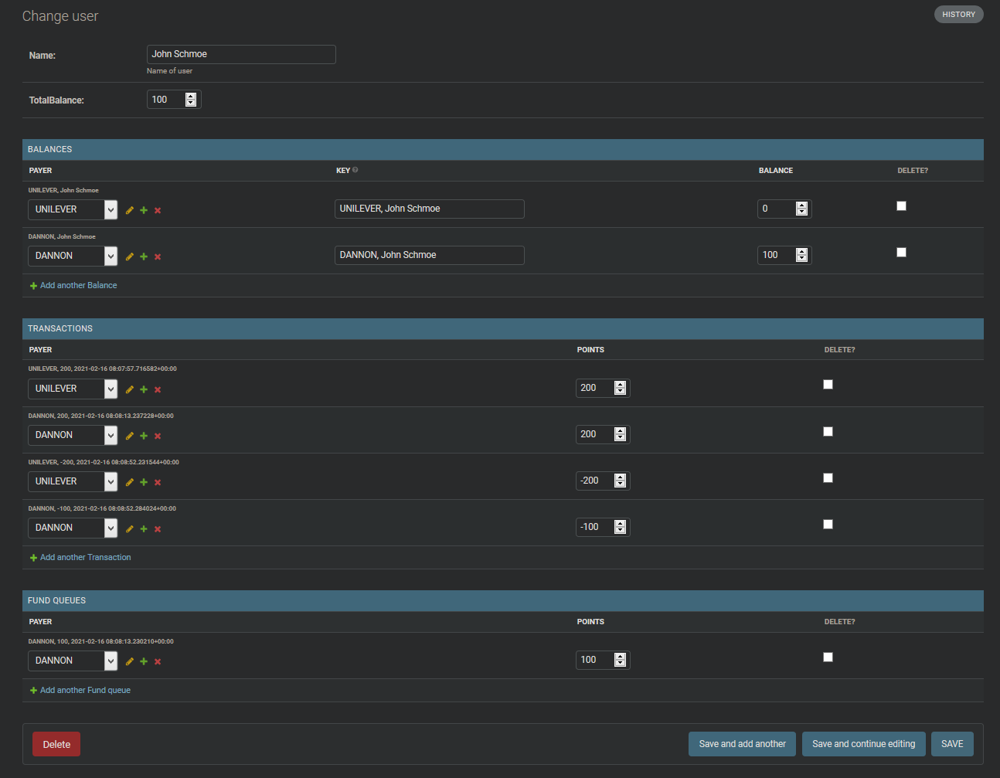
   
## Technologies
  
   Project created locally with the following technologies:

    Python 3.7.10
    Django 3.1.6
    Django REST Framework 3.12.2
    
   For the production version the requirements are:
   
        asgiref==3.3.1
        dj-database-url==0.5.0
        Django==3.1.6
        django-heroku==0.3.1
        djangorestframework==3.12.2
        gunicorn==20.0.4
        psycopg2==2.8.6
        psycopg2-binary==2.8.6
        pytz==2021.1
        sqlparse==0.4.1
        whitenoise==5.2.0

## Setup
  
   To setup this project, simply download the files, [install the requirements](https://developer.mozilla.org/en-US/docs/Learn/Server-side/Django/development_environment) and run the following command:
   
    python manage.py runserver
    
   Then navigate to https://127.0.0.1:8000/api/ on your web browser of your choice.
    
   To deploy use the hosting branch which is produced for set up with Heroku.

        git push heroku master
        heroku run python manage.py migrate
        heroku open
   
   Follow [this guide](https://developer.mozilla.org/en-US/docs/Learn/Server-side/Django/Deployment) to deploy a project from Django to Heroku.
        
        
## About Me
   This was my first project in Django, and first web development project involving a database. I really enjoyed making this project, and about managing a database and back-end engineering. I tried to implement best practices where I could.